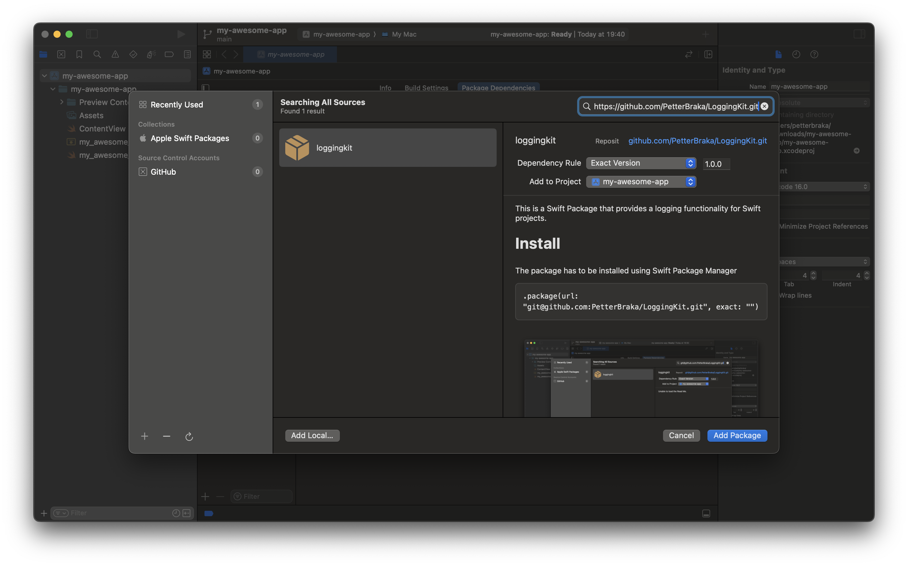

This is a Swift Package that provides a logging functionality for Swift projects.

# TLDR
Create your instance of `LoggerService`.
```Swift
let logger = LoggerService()
```

Create your Logging categories.
```Swift
extension LogCategory {
    ...
    static let database = LogCategory(name: "Database")
    static let network = LogCategory(name: "Network")
    ...
}
```
Log your events to the console.
```Swift
...
logger.log(category: .database, message: "Opening database", error: nil, level: .debug)
...
logger.log(category: .database, message: "Failed to open database", error: error, level: .debug)
...
```
Control which categories are being logged. By default all categories will be logged.
```Swift
logger.enable(.database, .network)
logger.disable(.database)
```

# Install
The package has to be installed using Swift Package Manager

```
.package(url: "git@github.com:PetterBraka/LoggingKit.git", exact: "")
```

